# Visual-Textual Dermatoglyphic Animal Biometrics: A First Case Study on *Panthera tigris*

This repository contains the **official project files and source code** for the paper:

**Visual-textual Dermatoglyphic Animal Biometrics: A First Case Study on *Panthera tigris***

- [Paper homepage](https://wenshuoli001.github.io/vt-tiger-bio.github.io/)
- [arXiv](https://arxiv.org/abs/2512.14878)

---

## Overview

Biologists have long combined photographs and sketches with textual field notes to re-identify (Re-ID) individual animals based on phenotypic traits. Contemporary AI-supported camera trapping builds on this visual tradition, with computer vision tools now supporting animal re-identification across numerous species with distinctive morphological features, such as unique stripe-like coats (e.g., zebras, tigers). Here, we present the first study to extend image-only Re-ID methodologies by incorporating precise dermatoglyphic textual descriptors -- an approach widely used in forensic science but hitherto unexploited in ecology. We demonstrate that these specialist semantics can abstract and encode both the topology and structure of animal stripe coats using fully human-interpretable language tags. Drawing on 84,264 manually labelled minutiae features across 3,355 images of 185 individual tigers (Panthera tigris), we provide a comprehensive quantitative case study evaluating this new visual–textual methodology in detail, revealing novel capabilities for cross-modal dermatoglyphic animal identity retrieval. To optimise performance we synthesise 2,000 ‘virtual individuals’ multimodally, each comprising dozens of life-like tiger visuals in ecologically credible camera trap configurations paired with matching dermatoglyphic text descriptors of visible coat features. Benchmarking against real-world camera trap Re-ID scenarios shows that such augmentation can double AI accuracy in cross-modal retrieval while alleviating challenges of data scarcity for rare species and expert annotation bottlenecks. We conclude that dermatoglyphic language-guided animal biometrics can overcome key limitations of vision-only solutions and, for the first time, enable textual-to-visual identity recovery underpinned by human-verifiable minutiae matchings. Conceptually, this represents a significant advance towards explainability in Re-ID and a broader language-driven unification of descriptive modalities in AI-based ecological monitoring.

---
### From Visual Minutiae Features to Dermatoglyphic Text Descriptions


---

## Repository Structure

This repository contains the following components from the paper:

1. Minutiae library construction and UV synthesis  
2. Houdini-based 3D modelling  
3. Rendering, background fusion, and post-processing  
4. Datasets (real and synthetic)  
5. Text and image Re-ID experiments  
6. Text-to-image Re-ID experiments  

---

## 1. Minutiae Library Construction and UV Synthesis

**Directory**: `UV_synthesis/`

This folder contains dermatoglyphic minutiae cropped from real-world tiger images, along with keypoint annotations.

- `augmentation/`  
  Minutiae image augmentation code.

- `synthesis/`  
  Region-aware statistical synthesis and RBF-based image warping correction guided by anatomical distribution priors.

### Visual-textual Co-Synthesis:


### Synthetic UVs

you can download them from: [here](https://drive.google.com/drive/folders/1QvQmridbL7Vk-Ttm6C7ZNv_FMzU4wKCe?usp=drive_link)


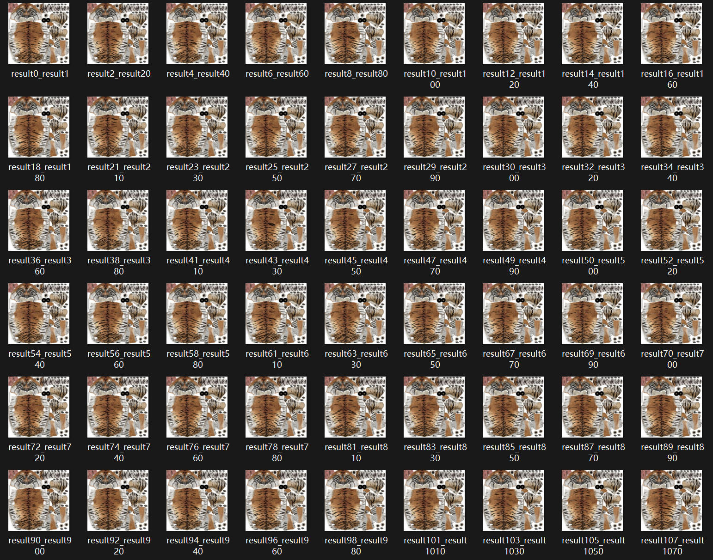

---

## 2. Houdini 3D Modeling (Hair, Pose, and Rendering)

**Directory**: `Houdini_project/`

This folder contains:
- 3D tiger mesh source files  
- Texture maps  

HDRI can be downloaded from: [here](https://drive.google.com/drive/folders/1QvQmridbL7Vk-Ttm6C7ZNv_FMzU4wKCe?usp=drive_link)

The main Houdini project file `tiger.hipnc` includes:
- Hair grooming and physical simulation  
- Pose modelling and regional binding  
- Karma renderer stage construction  
- Lighting and camera configuration  

Houdini version: 20.0

Batch rendering scripts `houdini_rendering.py` are provided and should be executed within Houdini’s built-in Python.

**Pipeline illustrations**:
### Distortion-corrected Texture Mapping and 3D Pose Modelling:

### Biomimetic Pelage Synthesis:


### Houdini Detail:
#### OBJ panel configuration:
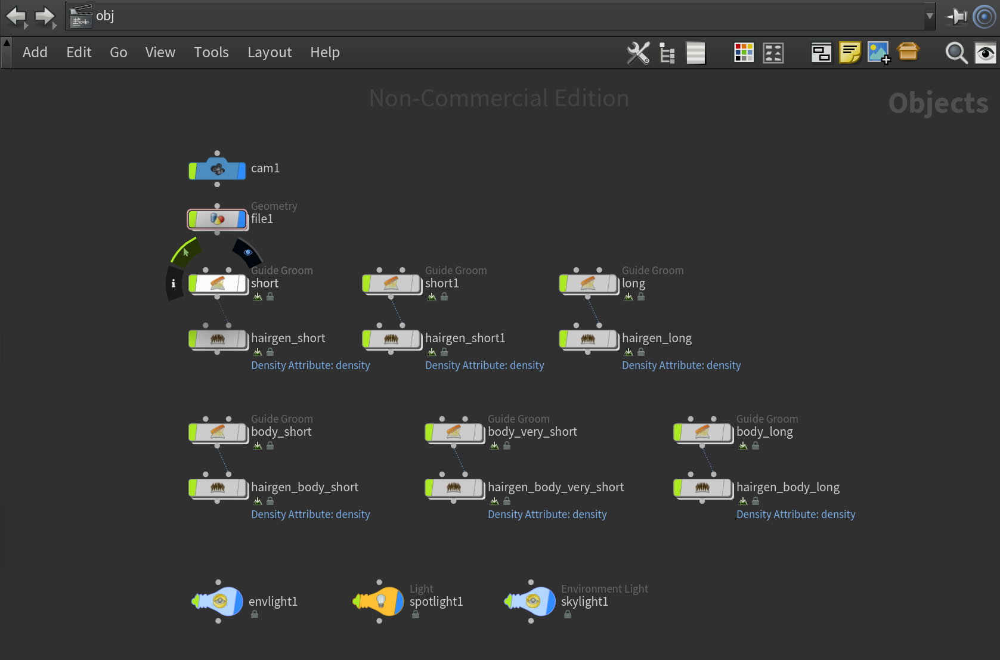

#### Pose modelling and region binding:
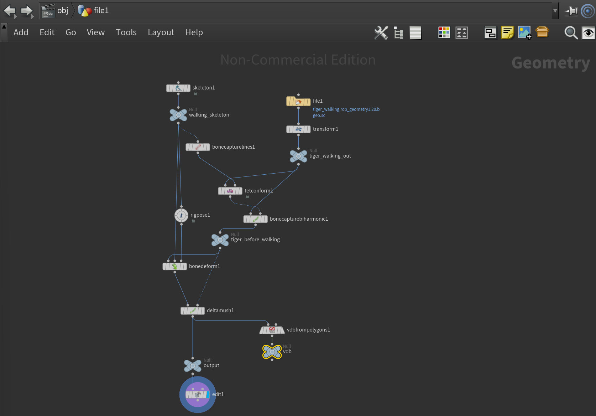

#### Hair modelling and physical simulation:
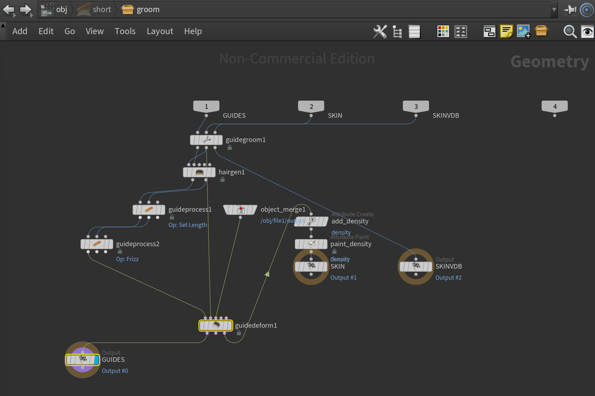

#### Stage migration for Karma renderer:
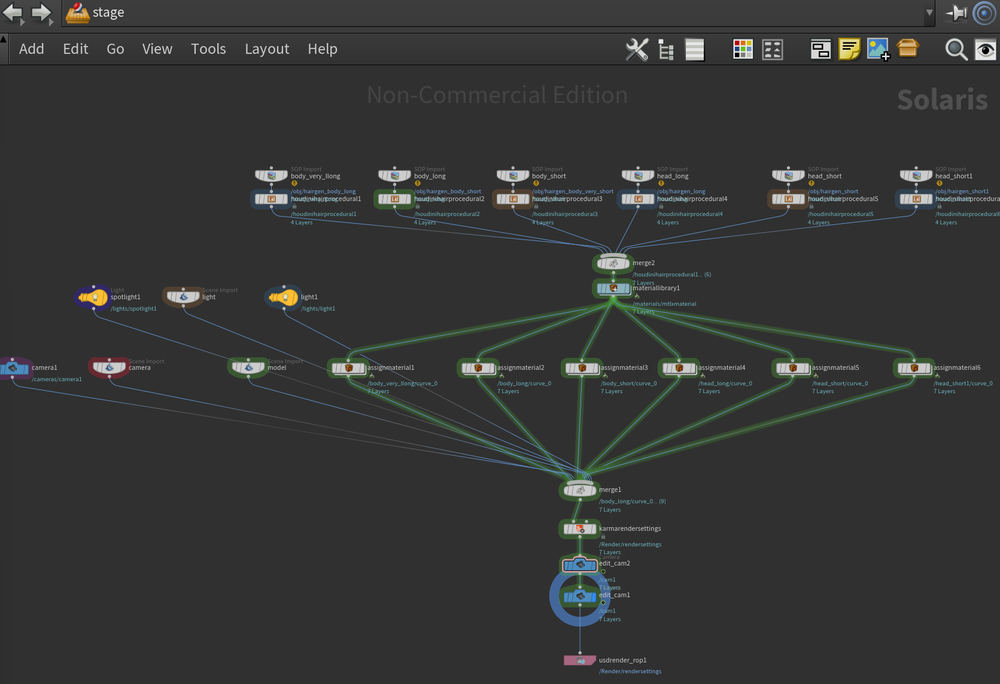

#### Stage materials:
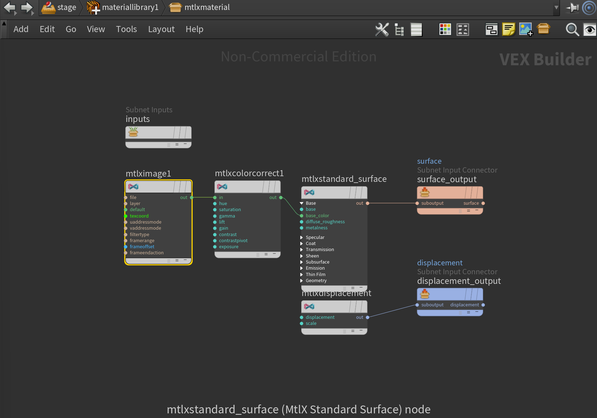

---

## 3. Rendering, Background Fusion, and Post-Processing

**Directory**: `render/`

This module includes:
- 80 real camera-trap background images  
- Foreground processing  
- Foreground–background fusion  
- Post-processing scripts  

Foreground–background harmonisation uses **Harmonizer**:  
https://github.com/ZHKKKe/Harmonizer  

Please cite the corresponding paper when using this component.

### Rendering in realistic scenarios:
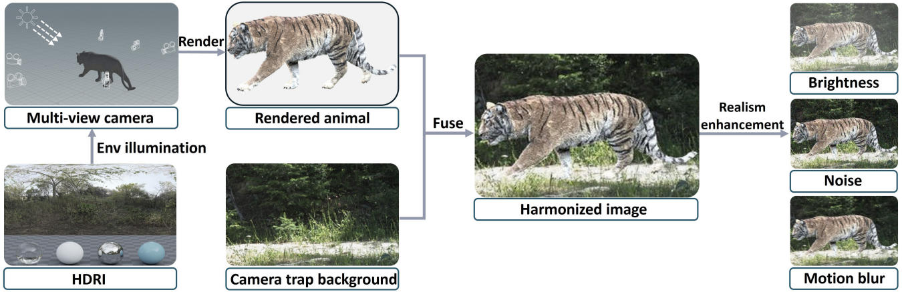

---

## 4. Datasets

### Real-world datasets

you can download from: [here](https://drive.google.com/drive/folders/1QvQmridbL7Vk-Ttm6C7ZNv_FMzU4wKCe?usp=drive_link)

This contains 185 individuals and a total of 3,355 images, each cropped and paired with manually annotated, ACE-based dermatoglyphic descriptions of the coat pattern features.The images are sourced from：
- **ATRW**  
  https://weiyaolin.github.io/pdf/ATRW.pdf  
- **Camera Trap Database of Tiger (Rajaji National Park)**  
  https://www.gbif.org/dataset/e61455a4-352d-4c55-83ea-dbca254e3b29  


### Synthetic datasets

you can download from: [here](https://drive.google.com/drive/folders/1QvQmridbL7Vk-Ttm6C7ZNv_FMzU4wKCe?usp=drive_link)

Synthetic data were generated using our **image–text co-synthesis pipeline**, following ATRW standards.This covers 2,000 synthesised individuals across 24,000 images, with 12 images per virtual tiger under varying viewpoints and pose. Each image is accompanied by a corresponding, generated description
of its stripe pattern structure.

### Dataset formats

- **Single-modal and multimodal Re-ID**: formatted according to **Market-1501**  
  https://ieeexplore.ieee.org/document/7410490  

- **Text-to-image Re-ID**: formatted according to **RSTPReid**  
  https://github.com/NjtechCVLab/RSTPReid-Dataset  

Please cite the above datasets and papers when using them.

### Synthetic dataset examples:
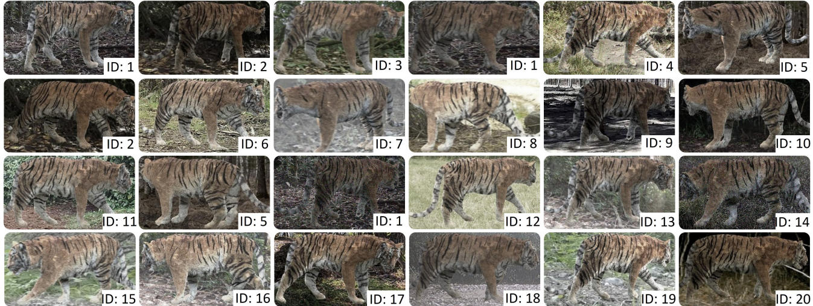

---

## 5. Text and Image Re-ID Experiments

**Directory**: `t_and_i_reid/`

### Reid protocols:
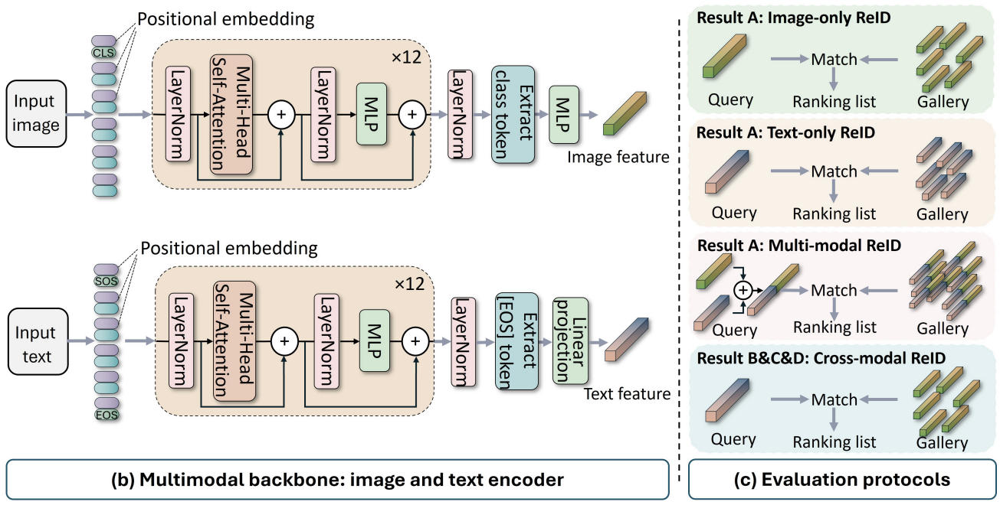

This code is partially based on:
- **TransReID**: https://github.com/damo-cv/TransReID  
- **IRRA**: https://github.com/anosorae/IRRA  

The environment setup is identical to IRRA.

### Model modification

Modify `model/make_model.py` as follows for different tasks:

```python
global_feat = t_feats
feat = self.bottleneck(global_feat)
````

put the data into 'data/amurtiger/'


### Training
```
python train.py --config_file configs/AmurTiger/vit_base.yml MODEL.DEVICE_ID "('0')"
```

### Testing

```bash
python test.py --config_file configs/AmurTiger/vit_base.yml MODEL.DEVICE_ID "('0')" TEST.WEIGHT 'result/clipmix_650.pth'
```

Best same-modality Re-ID checkpoint can be downloaded from: [here](https://drive.google.com/drive/folders/1QvQmridbL7Vk-Ttm6C7ZNv_FMzU4wKCe?usp=drive_link)

### Single-text Re-ID results:
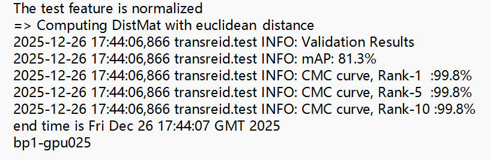

---

## 6. Text-to-Image Re-ID Experiments

**Directory**: `t_to_i_reid/`

This module also follows the **IRRA** framework and environment.

* **Baseline**: real-world data only
* **Evaluation strategy**: keep the test set fixed and progressively add synthetic individuals to the training set
### Synthetic data evaluation strategy:


### Dataset placement

Place the dataset directly under the project root.

### Training

```bash
python train.py --name iira --img_aug --loss_names 'itc+id' \
--dataset_name 'RSTPReid' \
--root_dir 'reiddataset_real+1000' \
--num_epoch 50
```

### Testing

```bash
python test.py --config_file 'logs/RSTPReid/20250312_133553_iira/configs.yaml'
```

Ablation studies show that adding **1,000 synthetic individuals** yields optimal text-to-image Re-ID performance.

Best checkpoint can be downloaded from: [here](https://drive.google.com/drive/folders/1QvQmridbL7Vk-Ttm6C7ZNv_FMzU4wKCe?usp=drive_link)

### Baseline text-to-image Re-ID:
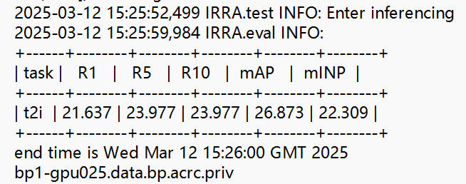

### Optimal text-to-image Re-ID:
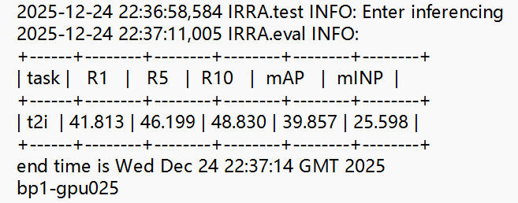

---

## Acknowledgements

We gratefully acknowledge the authors of the following works and repositories:

* ATRW
* Market-1501
* RSTPReid
* TransReID
* IRRA
* Harmonizer
* SideFX Houdini

---

## Citation

If you use this work, please cite:

```bibtex
@article{li2025visual,
  title={Visual-textual Dermatoglyphic Animal Biometrics: A First Case Study on Panthera tigris},
  author={Li, Wenshuo and Mirmehdi, Majid and Burghardt, Tilo},
  journal={arXiv preprint arXiv:2512.14878},
  year={2025}
}
```

